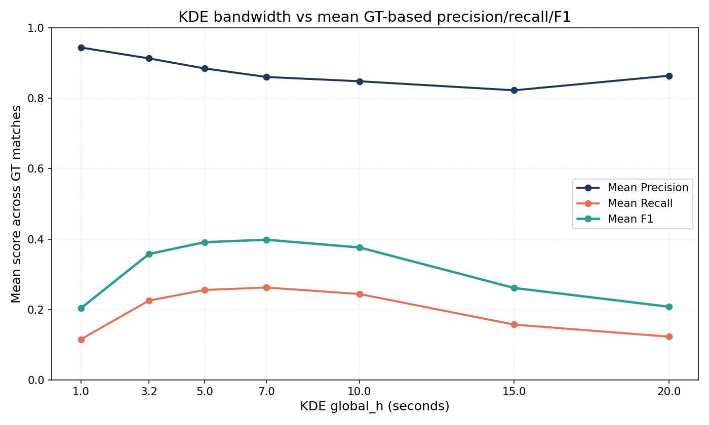
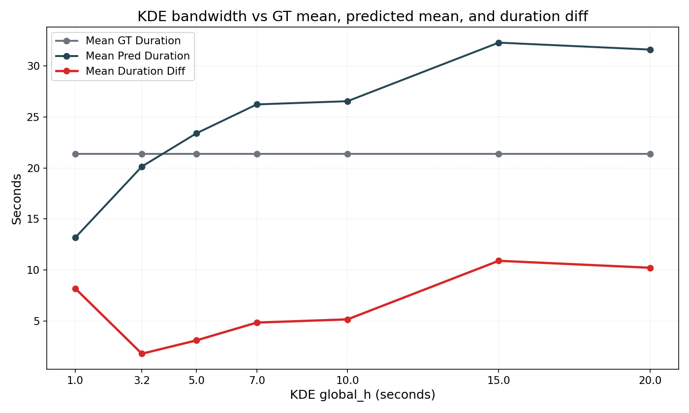
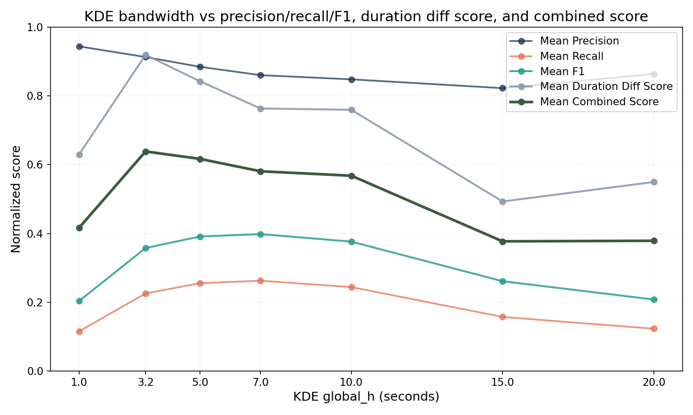

# KDE Bandwidth Sensitivity

This supplementary note addresses the reviewer question on how sensitive highlight detection is to the KDE bandwidth `h`.

## Ground Truth

We evaluate KDE segment extraction against manually aligned ground-truth highlight intervals constructed from curated YouTube highlight videos of the same matches. The intervals are aligned to the corresponding broadcast videos using a synchronization point between game time and video time.

## Settings

The KDE-based segment selector uses a Gaussian kernel, density-threshold factor `= 5.0`, and minimum interaction count `= 2`. The selected bandwidth is computed from a robust global statistic of inter-event intervals: `Q1 = 4.0` seconds and `h = 0.8 x Q1 = 3.2` seconds.

## Quantitative Comparison

| `h` | Precision | Recall | F1 | Mean GT Duration | Mean Pred Duration | Mean Duration Diff |
| --- | --- | --- | --- | --- | --- | --- |
| 1.0 | 0.9443 | 0.1155 | 0.2034 | 21.37 | 13.18 | 8.19 |
| 3.2 | 0.9132 | 0.2256 | 0.3578 | 21.37 | 20.14 | 1.80 |
| 5.0 | 0.8848 | 0.2557 | 0.3913 | 21.37 | 23.39 | 3.11 |
| 7.0 | 0.8606 | 0.2627 | 0.3983 | 21.37 | 26.23 | 4.85 |
| 10.0 | 0.8484 | 0.2442 | 0.3764 | 21.37 | 26.54 | 5.17 |
| 15.0 | 0.8227 | 0.1574 | 0.2613 | 21.37 | 32.28 | 10.91 |
| 20.0 | 0.8641 | 0.1231 | 0.2080 | 21.37 | 31.60 | 10.23 |

## Interpretation

The results show a clear tradeoff. Small bandwidths keep segments tight but fragment interactions, leading to low recall. Larger bandwidths improve recall and mean F1 by merging nearby events more aggressively, but they also broaden the selected intervals. In pure overlap terms, `h = 7.0` gives the highest mean F1 (`0.3983`). However, `h = 3.2` gives the smallest mean duration difference (`1.80` seconds), which means its predicted segments best match the temporal extent of the ground-truth highlights.

We also compute a supplementary equal-weight combined score between F1 and duration alignment. Under that criterion, `h = 3.2` performs best overall. We therefore keep `h = 3.2` as a conservative operating point: it preserves high precision, achieves competitive recall, and yields the most temporally concise highlight localization.

## Qualitative Examples

Because OpenReview does not display large image supplements well, the qualitative bandwidth examples are provided through the GitHub supplementary materials:

- [NS_vs_DK_-_BRO_vs_T1_2024_LCK_4_multi_kde_rect_comparison.png](/home/user/Documents/icml/anonymous-submission/kde_ablation/NS_vs_DK_-_BRO_vs_T1_2024_LCK_4_multi_kde_rect_comparison.png)
- [T1_vs_NS_-_HLE_vs_KT_2024_LCK_4_multi_kde_rect_comparison.png](/home/user/Documents/icml/anonymous-submission/kde_ablation/T1_vs_NS_-_HLE_vs_KT_2024_LCK_4_multi_kde_rect_comparison.png)
- [GEN_vs_DRX_-_KT_vs_DK_2023_LCK_3_multi_kde_rect_comparison.png](/home/user/Documents/icml/anonymous-submission/kde_ablation/GEN_vs_DRX_-_KT_vs_DK_2023_LCK_3_multi_kde_rect_comparison.png)

Qualitatively, small bandwidths produce fragmented segments, whereas large bandwidths generate overly broad intervals. The selected setting `h = 3.2` remains the best compromise when both overlap quality and temporal tightness are considered.
