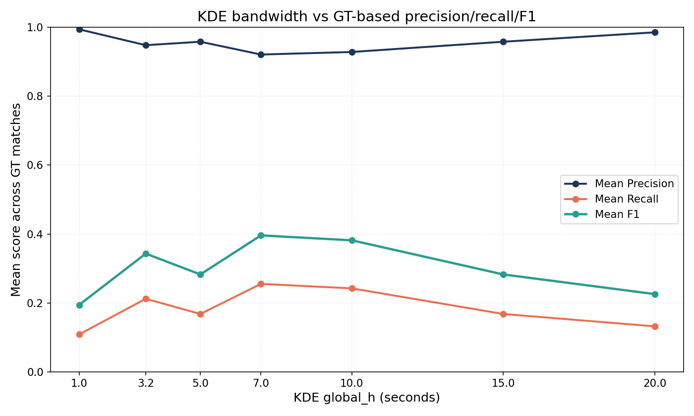
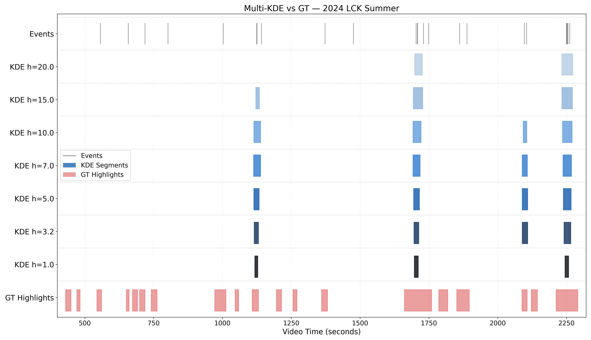
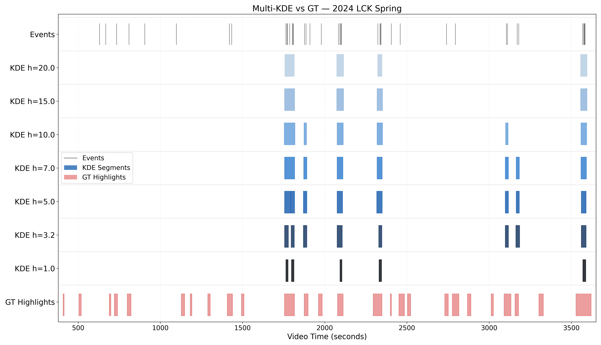
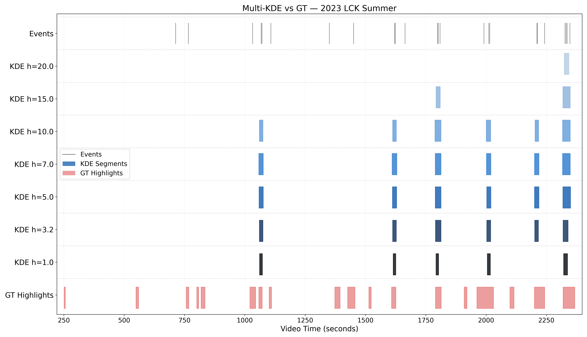

## Reviewer Question 1

> "The approach relies heavily on visible HUD elements (minimap, event logs), limiting applicability to games with minimal UI or cinematic-style recordings."

We agree that this is an important limitation to clarify. In the current work, the Salient Interaction Module is designed for **UI-rich gameplay videos** where interaction cues are observable on the game screen itself. This assumption is also common in prior game-video understanding work, where on-screen cues such as OCR-recognized text and HUD elements are often used because they provide compact summaries of game state. Our method also operates in this practical setting, but it does not rely on external APIs or text-based cues. Instead, it relies on visual interaction signals within the game screen itself, specifically on-screen event-log regions with champion icons, as structured indicators of gameplay interactions. We will clarify this scope more explicitly in the revision.

## Reviewer Question 2

> "Generalizability: How could the Salient Interaction Module adapt to games without explicit event logs or minimaps? Is it feasible to detect interactions solely from pixel-level character behavior?"

We believe this is feasible in principle, but it would require a different front-end than the one used in the current paper. Rather than relying on event logs with champion icons that appear on the gameplay screen, a future system could infer visual interaction signals directly from raw visual observations such as character trajectories, proximity patterns, combat engagement, camera dynamics, or multi-agent coordination patterns, without depending on HUD- or log-like cues. After obtaining such interaction signals, KDE or a similar temporal grouping mechanism could still be applied to identify salient interaction segments.

So our view is that the main limitation lies in the **current source of interaction cues**, not necessarily in the interaction-segment formulation itself. We will state this more clearly as a limitation and future extension direction in the revision.

# KDE Bandwidth Sensitivity for Key Interaction Segment Selection

Thank you for the question regarding bandwidth selection. This note summarizes the additional analysis addressing how sensitive highlight detection is to the KDE bandwidth `h`.

## Question Addressed

> Appendix B mentions selecting the bandwidth `h` using a global statistic. How sensitive is highlight detection and caption quality to variations in this bandwidth?

## Ground-Truth Highlights

The bandwidth sensitivity evaluation uses manually aligned ground-truth highlight intervals constructed from curated YouTube highlight videos of the same matches. These intervals are aligned to the corresponding full broadcast videos using a synchronization point between game time and video time, and are used to evaluate temporal overlap-based precision, recall, and F1 across different bandwidth settings.

## KDE Parameters

The KDE-based segment selection uses the following main parameters:

- Gaussian kernel
- bandwidth `h`
- density-threshold factor `= 5.0`
- minimum interaction count `= 2`

The selected bandwidth is computed from a robust global statistic of inter-event intervals:

- `Q1 = 4.0` seconds
- `h = 0.8 x Q1 = 3.2` seconds

## Quantitative Bandwidth Comparison

| `h` | Precision | Recall | F1 |
| --- | --- | --- | --- |
| 1.0 | 0.9941 | 0.1089 | 0.1945 |
| 3.2 | 0.9480 | 0.2123 | 0.3433 |
| 5.0 | 0.9581 | 0.1682 | 0.2828 |
| 7.0 | 0.9209 | 0.2555 | 0.3962 |
| 10.0 | 0.9283 | 0.2425 | 0.3819 |
| 15.0 | 0.9581 | 0.1682 | 0.2828 |
| 20.0 | 0.9853 | 0.1323 | 0.2258 |

## Quantitative Interpretation

The results show that highlight detection is **meaningfully sensitive** to the bandwidth choice.

- At very small bandwidths such as `h = 1.0`, precision is extremely high (`0.9941`), but recall is very low (`0.1089`). This means the predicted segments are temporally sharp but too fragmented to cover many complete highlights.
- As bandwidth increases, recall generally improves because nearby events are merged more readily into broader interaction segments.
- Larger bandwidths such as `h = 7.0` and `h = 10.0` achieve the highest recall and F1, showing that broader smoothing can improve overlap with the ground-truth intervals.
- However, larger bandwidths also lead to less temporally concise segments, which is undesirable when the goal is precise highlight localization.

For this reason, we select **`h = 3.2`** as a conservative operating point. Although it does not maximize F1, it preserves high precision (`0.9480`) while still improving recall substantially over very small bandwidths. In other words, `h = 3.2` provides a better balance when the goal is not only to cover highlights, but also to keep interaction segments temporally tight.

## Qualitative Bandwidth Comparison

The following examples compare KDE predictions across multiple bandwidth values against ground-truth highlights.

Because OpenReview space is limited, the full qualitative visualizations can be referred to through the GitHub supplementary materials if needed. The explanation is retained here so that the qualitative behavior across bandwidth values remains clear even when the figures are referenced externally.

Visual encoding:

- Black lines: interaction events
- Blue rectangles: predicted KDE segments
- Red rectangles: ground-truth highlights

### `NS_vs_DK_-_BRO_vs_T1_2024_LCK_4_multi_kde_rect_comparison.png`

### `T1_vs_NS_-_HLE_vs_KT_2024_LCK_4_multi_kde_rect_comparison.png`

### `GEN_vs_DRX_-_KT_vs_DK_2023_LCK_3_multi_kde_rect_comparison.png`

## Qualitative Interpretation

The qualitative examples support the same pattern seen in the quantitative results.

- Small bandwidths produce fragmented segments that often fail to capture complete interactions.
- Large bandwidths merge temporally nearby events into overly broad intervals that can extend beyond the annotated highlight regions.
- The selected setting `h = 3.2` produces segments that remain temporally concise while still aligning well with the ground-truth highlight intervals.
