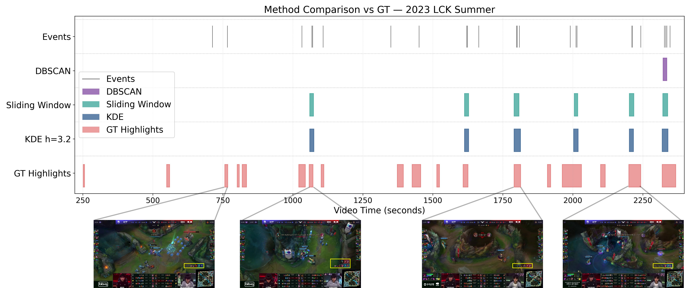
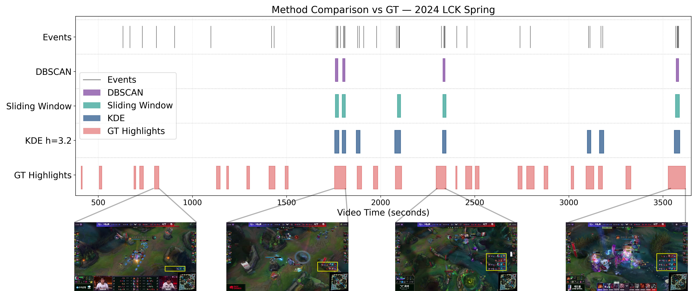
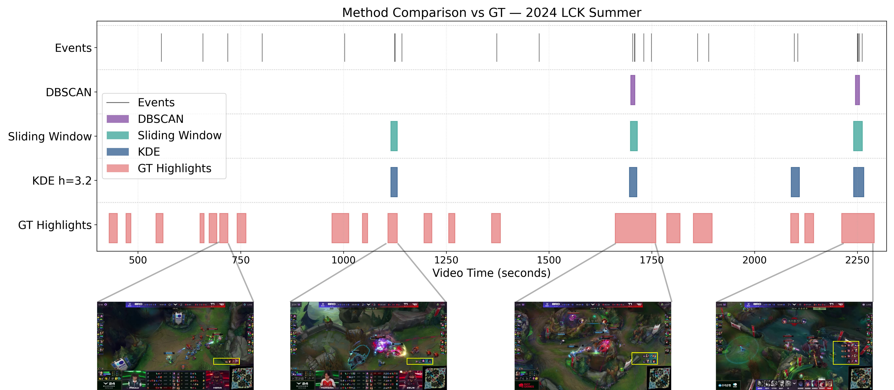

# Multi-Method Comparison for Key Interaction Segment Selection

Thank you for the helpful suggestion to compare the KDE-based segment selection method against alternative segment selection strategies. This note summarizes the added multi-method comparison used to validate the segment selection choice.

## Ground-Truth Highlights

The evaluation uses manually aligned ground-truth highlight intervals constructed from curated YouTube highlight videos of the same matches. These highlight intervals are aligned to the corresponding full broadcast videos using a synchronization point between game time and video time, and are used for temporal overlap-based evaluation.

## Compared Methods

We compare three non-learned segment selection strategies against manually aligned ground-truth highlight intervals:

- **KDE**: bandwidth `h = 3.2`, density-threshold factor `= 5.0`, minimum interaction count `= 2`
- **DBSCAN**: neighborhood radius `epsilon = 6.0`, minimum samples `= 2`
- **Sliding Window**: window size `= 12.0` seconds, event-count threshold `= 2`

These methods are compared on the same matches and evaluated against the aligned ground-truth highlight intervals using temporal overlap-based precision, recall, and F1.

## Aggregate Results

| Method | Mean Precision | Mean Recall | Mean F1 | Std Precision | Std Recall | Std F1 | Mean # Segments |
| --- | --- | --- | --- | --- | --- | --- | --- |
| DBSCAN | 1.0000 | 0.0476 | 0.0903 | 0.0000 | 0.0173 | 0.0313 | 2.33 |
| Sliding Window | 0.9848 | 0.1504 | 0.2565 | 0.0216 | 0.0548 | 0.0795 | 4.67 |
| KDE h=3.2 | 0.9480 | 0.2123 | 0.3433 | 0.0194 | 0.0521 | 0.0711 | 6.00 |

## Result Interpretation

The aggregate results show that **KDE h=3.2** achieves the best overall balance among the compared methods.

- **DBSCAN** reaches perfect mean precision (`1.0000`), but its recall is extremely low (`0.0476`). This means DBSCAN is very conservative: when it predicts a segment it is usually correct, but it misses most of the ground-truth highlights.
- **Sliding Window** improves recall to `0.1504` and F1 to `0.2565`, which shows that a simple count-threshold baseline can recover more highlights than DBSCAN. However, because it uses fixed temporal windows, it cannot adapt well to the variable duration of interaction-heavy moments.
- **KDE h=3.2** achieves the highest mean recall (`0.2123`) and the highest mean F1 (`0.3433`) while still maintaining high precision (`0.9480`). This indicates that KDE captures more of the annotated highlight intervals without giving up much temporal precision.

Overall, the results suggest that KDE is better suited for **Key Interaction Segment** selection because it adapts to the temporal density of events. In contrast, DBSCAN tends to be too sparse, while Sliding Window is less precise in localizing the temporal extent of highlights.

## Qualitative Examples

The following qualitative comparisons visualize predicted segments against ground-truth highlights.

Because OpenReview space is limited, the full qualitative visualizations can be referred to through the GitHub supplementary materials if needed. The explanation is retained here so that the interpretation of the qualitative results remains clear even when the figures are referenced externally.

Visual encoding:

- Black lines: interaction events
- Purple rectangles: DBSCAN predictions
- Green rectangles: Sliding Window predictions
- Blue rectangles: KDE predictions
- Red rectangles: ground-truth highlights

### `23_summer.pdf`

Original PDF: [23_summer.pdf](./23_summer.pdf)

### `24_spring.pdf`

Original PDF: [24_spring.pdf](./24_spring.pdf)

### `24_summer.pdf`

Original PDF: [24_summer.pdf](./24_summer.pdf)

## Qualitative Interpretation

The qualitative results are consistent with the aggregate metrics.

- **DBSCAN** produces sparse detections and often leaves many ground-truth intervals uncovered.
- **Sliding Window** improves coverage, but its fixed temporal scope often causes boundaries to extend beyond or miss the true highlight duration.
- **KDE** produces segments that more closely match the location and duration of the ground-truth highlights, which is consistent with its stronger recall-F1 tradeoff in the quantitative comparison.
